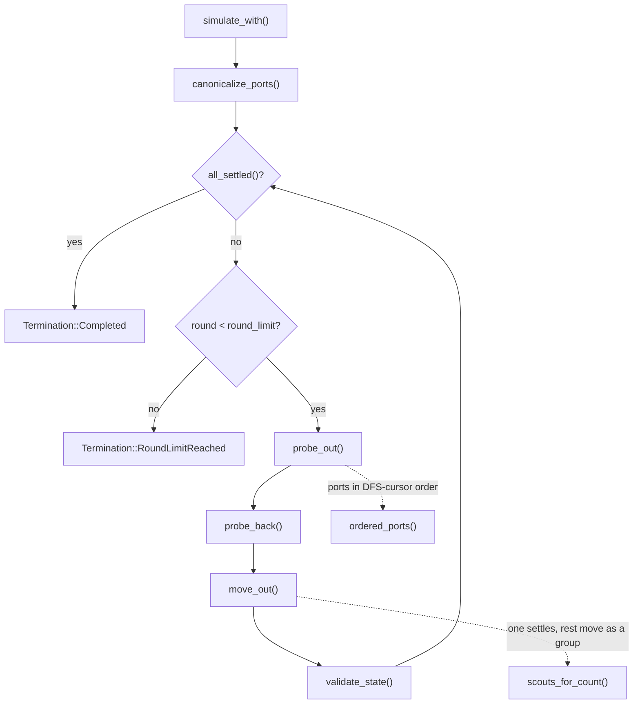
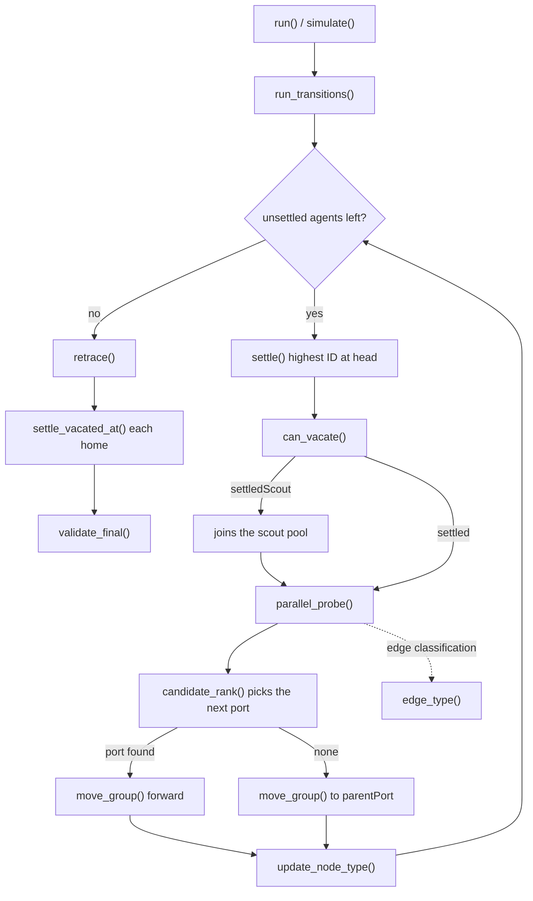
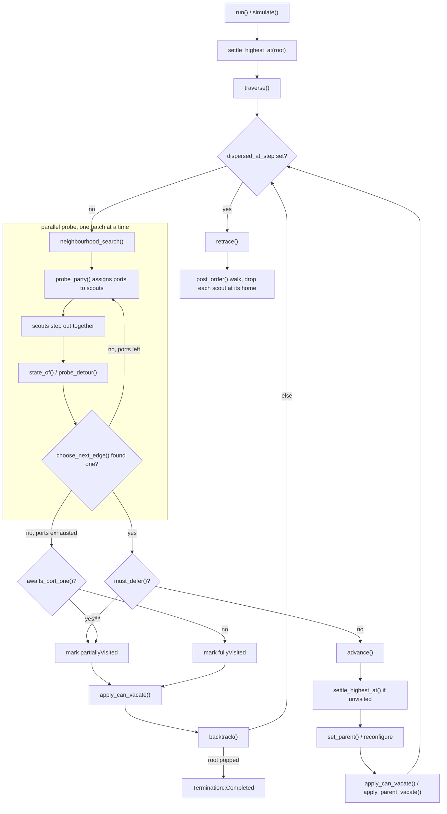

# Algorithm flowcharts

One flowchart per algorithm, with the code of every function the chart names.

The charts are the control flow as implemented, not as idealised: where the
implementation departs from a paper, the chart shows what the code does and the
note beside it says why. Read [behavior-spec.md](behavior-spec.md) for
Drop-and-Freeze and Help-by-Scouts, and [p1tree.md](p1tree.md) for P1Tree,
before drawing conclusions from any of them.

> Generated by [`scripts/gen-flowcharts.sh`](../scripts/gen-flowcharts.sh). The
> code blocks are extracted from the crates, so editing this file by hand will
> be overwritten. Re-run the script after changing any function it quotes.

## Contents

- [Drop and Freeze](#drop-and-freeze) — `ccm-algorithms`
- [Help by Scouts](#help-by-scouts) — `ccm-help-scouts`
- [P1Tree](#p1tree) — `ccm-p1tree`

---

## Drop and Freeze

Three phases per round, over the agents standing on each node. Unsettled agents
fan out one per port to look at a neighbour, come back carrying one bit — was it
occupied — and then one of them settles while the rest move on together through
a port a probe reported empty. When no empty port is left the group backtracks
along the port it first arrived by, so the walk is a DFS whose tree is held by
the settled agents.



`canonicalize_ports` is a compatibility decision rather than an algorithmic one:
the Python reference replaced any supplied local port labels with canonical
sorted-neighbour ones, so this port does too. It means Drop-and-Freeze ignores
the port assignment the experiment asked for.

```rust
/// Runs Drop-and-Freeze while allowing callers to provide a metrics sink and
/// recorder.  The algorithm itself never depends on either observer.
///
/// # Errors
///
/// Returns an error when the graph is invalid, a start node is outside the
/// graph, or an invariant fails during a transition.
pub fn simulate_with<M: Metrics, R: Recorder>(
    graph: &PortGraph,
    starts: &[NodeId],
    round_limit: u64,
    metrics: &mut M,
    mut recorder: R,
) -> Result<SimulationRun<R::Output>, DropAndFreezeError> {
    if starts.len() > u32::MAX as usize {
        return Err(DropAndFreezeError::TooManyAgents(starts.len()));
    }
    for &node in starts {
        if node.index() >= graph.node_count() {
            return Err(DropAndFreezeError::InvalidStart(node));
        }
    }

    // Python `_init_ports` replaces any supplied local labels with canonical
    // sorted-neighbor ports.  Normalize before executing the transition rules.
    let graph = canonicalize_ports(graph)?;
    let mut state = SimulationState {
        agents: starts
            .iter()
            .copied()
            .map(DropAgentState::unsettled)
            .collect(),
        settled_agent_at: vec![None; graph.node_count()],
        node_status: vec![DropNodeStatus::Empty; graph.node_count()],
    };

    validate_state(&graph, &state)?;
    observe(metrics, &state);
    recorder.record(FrameLabel::Start, &state);

    let metadata = SimulationMetadata {
        node_count: graph.node_count(),
        agent_count: state.agents.len(),
        round_limit,
    };

    let mut completed = all_settled(&state);
    for round in 1..=round_limit {
        if completed {
            break;
        }
        metrics.macro_round();
        metrics.logical_rounds(RoundKind::ProbeOut, 1);
        probe_out(&graph, &mut state, metrics);
        validate_state(&graph, &state)?;
        observe(metrics, &state);
        recorder.record(FrameLabel::ProbeOut { round }, &state);

        metrics.logical_rounds(RoundKind::ProbeBack, 1);
        probe_back(&graph, &mut state, metrics)?;
        validate_state(&graph, &state)?;
        observe(metrics, &state);
        recorder.record(FrameLabel::ProbeBack { round }, &state);

        metrics.logical_rounds(RoundKind::Movement, 1);
        move_out(&graph, &mut state, metrics)?;
        validate_state(&graph, &state)?;
        observe(metrics, &state);
        recorder.record(FrameLabel::MoveOut { round }, &state);

        completed = all_settled(&state);
    }

    let termination = if completed {
        Termination::Completed
    } else {
        Termination::RoundLimitReached { limit: round_limit }
    };
    Ok(SimulationRun {
        metadata,
        final_state: state,
        termination,
        trace: recorder.finish(),
    })
}
```

```rust
fn canonicalize_ports(graph: &PortGraph) -> Result<PortGraph, GraphError> {
    let mut edges = Vec::with_capacity(graph.edge_count());
    for source_index in 0..graph.node_count() {
        let source = NodeId(u32::try_from(source_index).expect("PortGraph node IDs fit in u32"));
        for (_, edge) in graph.ports(source) {
            if source < edge.neighbor {
                edges.push((source, edge.neighbor));
            }
        }
    }
    PortGraph::from_undirected_edges(graph.node_count(), &edges)
}
```

```rust
fn ordered_ports(graph: &PortGraph, node: NodeId) -> Vec<PortId> {
    let mut ports: Vec<(PortId, PortEdge)> = graph.ports(node).collect();
    ports.sort_by_key(|(port, edge)| {
        if port.0 != 0 && edge.remote_port.0 == 0 {
            (0_u8, port.0)
        } else if port.0 == 0 {
            (1_u8, port.0)
        } else {
            (2_u8, port.0)
        }
    });
    ports.into_iter().map(|(port, _)| port).collect()
}
```

```rust
fn probe_out<M: Metrics>(graph: &PortGraph, state: &mut SimulationState, metrics: &mut M) {
    let (buckets, active) = occupancy(state);
    let mut moves = Vec::new();
    for node in active {
        let settled = state.settled_agent_at[node.index()];
        let mut unsettled: Vec<_> = buckets[node.index()]
            .iter()
            .copied()
            .filter(|&agent| {
                Some(agent) != settled
                    && state.agents[agent.index()].status == DropStatus::Unsettled
            })
            .collect();
        if unsettled.is_empty() {
            continue;
        }
        for &agent in &unsettled {
            let value = &mut state.agents[agent.index()];
            value.probe_home = None;
            value.probe_port = None;
            value.probe_result_empty = None;
        }
        if settled.is_none() && unsettled.len() == 1 {
            continue;
        }
        let ports = ordered_ports(graph, node);
        if ports.is_empty() {
            continue;
        }
        let start = settled.map_or(0, |agent| state.agents[agent.index()].next_port_to_try);
        if start >= ports.len() {
            continue;
        }
        unsettled.sort_unstable();
        for (agent, &port) in unsettled.iter().zip(ports[start..].iter()) {
            let Some(edge) = graph.traverse(node, port) else {
                continue;
            };
            let value = &mut state.agents[agent.index()];
            value.probe_home = Some(node);
            value.probe_port = Some(port);
            value.probe_result_empty = None;
            value.status = DropStatus::SettledWaiting;
            metrics.port_probe();
            metrics.probe_out_traversal();
            metrics.agent_moves(1);
            moves.push(ProbeMove {
                agent: *agent,
                destination: edge.neighbor,
            });
        }
    }
    for movement in moves {
        state.agents[movement.agent.index()].node = movement.destination;
    }
}
```

```rust
fn probe_back<M: Metrics>(
    graph: &PortGraph,
    state: &mut SimulationState,
    metrics: &mut M,
) -> Result<(), DropAndFreezeError> {
    let mut moves = Vec::new();
    for index in 0..state.agents.len() {
        let agent =
            ccm_core::AgentId(u32::try_from(index).expect("agent IDs fit in the dense u32 domain"));
        if state.agents[index].status != DropStatus::SettledWaiting {
            continue;
        }
        let source = state.agents[index].node;
        state.agents[index].probe_result_empty =
            Some(state.settled_agent_at[source.index()].is_none());
        state.agents[index].status = DropStatus::Unsettled;
        if let Some(home) = state.agents[index].probe_home {
            let Some(port) = local_port_to(graph, source, home) else {
                return Err(DropAndFreezeError::Invariant(
                    InvariantViolation::InvalidTraversal,
                ));
            };
            metrics.probe_back_traversal();
            metrics.agent_moves(1);
            moves.push((agent, home, port));
        }
    }
    for (agent, destination, _incoming_port) in moves {
        state.agents[agent.index()].node = destination;
    }
    Ok(())
}
```

```rust
#[allow(clippy::too_many_lines)]
fn move_out<M: Metrics>(
    graph: &PortGraph,
    state: &mut SimulationState,
    metrics: &mut M,
) -> Result<(), DropAndFreezeError> {
    let (buckets, active) = occupancy(state);
    let mut movers_by_node = vec![Vec::new(); state.node_status.len()];
    let mut active_with_movers = Vec::new();
    for node in active {
        let settled = state.settled_agent_at[node.index()];
        let movers: Vec<_> = buckets[node.index()]
            .iter()
            .copied()
            .filter(|&agent| {
                Some(agent) != settled
                    && state.agents[agent.index()].status == DropStatus::Unsettled
            })
            .collect();
        if !movers.is_empty() {
            active_with_movers.push(node);
            movers_by_node[node.index()] = movers;
        }
    }

    let mut newly_settled = vec![false; state.node_status.len()];
    for &node in &active_with_movers {
        if state.settled_agent_at[node.index()].is_some() {
            continue;
        }
        let agent = movers_by_node[node.index()].remove(0);
        let entry_pin = state.agents[agent.index()].entry_pin;
        let parent_port = entry_pin.filter(|&port| graph.traverse(node, port).is_some());
        state.agents[agent.index()].status = DropStatus::Settled;
        state.agents[agent.index()].parent_port = parent_port;
        state.agents[agent.index()].next_port_to_try = 0;
        state.settled_agent_at[node.index()] = Some(agent);
        state.node_status[node.index()] = DropNodeStatus::Occupied;
        newly_settled[node.index()] = true;
        metrics.settlement();
    }

    let mut planned = Vec::new();
    for &node in &active_with_movers {
        let movers = &movers_by_node[node.index()];
        if movers.is_empty() {
            continue;
        }
        let Some(settled) = state.settled_agent_at[node.index()] else {
            continue;
        };
        let ports = ordered_ports(graph, node);
        if ports.is_empty() {
            continue;
        }
        let cursor = state.agents[settled.index()].next_port_to_try;
        let mut scouts = movers.clone();
        if newly_settled[node.index()] {
            scouts.push(settled);
        }
        let mut empty_ports = Vec::new();
        for agent in scouts {
            let value = state.agents[agent.index()];
            if value.probe_home != Some(node) || value.probe_result_empty != Some(true) {
                continue;
            }
            let Some(port) = value.probe_port else {
                continue;
            };
            if graph.traverse(node, port).is_some() && !empty_ports.contains(&port) {
                empty_ports.push(port);
            }
        }
        empty_ports.sort_by_key(|port| {
            ports
                .iter()
                .position(|candidate| candidate == port)
                .unwrap_or(usize::MAX)
        });

        let chosen = empty_ports.iter().copied().find(|port| {
            ports
                .iter()
                .position(|candidate| candidate == port)
                .is_some_and(|index| index >= cursor)
        });
        if let Some(port) = chosen {
            let index = ports
                .iter()
                .position(|candidate| candidate == &port)
                .ok_or(DropAndFreezeError::Invariant(
                    InvariantViolation::InvalidTraversal,
                ))?;
            let edge = graph
                .traverse(node, port)
                .ok_or(DropAndFreezeError::Invariant(
                    InvariantViolation::InvalidTraversal,
                ))?;
            state.agents[settled.index()].next_port_to_try = index + 1;
            planned.push(MoveGroup {
                agents: movers.clone(),
                from: node,
                port,
                destination: edge.neighbor,
                backtrack: false,
            });
            continue;
        }

        let probed_count =
            scouts_for_count(state, node, movers, newly_settled[node.index()], settled);
        state.agents[settled.index()].next_port_to_try =
            core::cmp::min(ports.len(), cursor.saturating_add(probed_count));
        if state.agents[settled.index()].next_port_to_try < ports.len() {
            continue;
        }
        let Some(parent_port) = state.agents[settled.index()].parent_port else {
            continue;
        };
        let Some(edge) = graph.traverse(node, parent_port) else {
            continue;
        };
        state.agents[settled.index()].next_port_to_try = ports.len();
        planned.push(MoveGroup {
            agents: movers.clone(),
            from: node,
            port: parent_port,
            destination: edge.neighbor,
            backtrack: true,
        });
    }

    for group in planned {
        metrics.group_move(group.agents.len());
        if group.backtrack {
            metrics.backtrack();
        }
        metrics.agent_moves(group.agents.len() as u64);
        for agent in group.agents {
            let value = &mut state.agents[agent.index()];
            value.node = group.destination;
            let incoming = local_port_to(graph, group.destination, group.from).ok_or(
                DropAndFreezeError::Invariant(InvariantViolation::InvalidTraversal),
            )?;
            value.pin = Some(incoming);
            value.entry_pin = Some(incoming);
            value.probe_home = None;
            value.probe_port = None;
            value.probe_result_empty = None;
        }
    }
    Ok(())
}
```

---

## Help by Scouts

Also a DFS, but settled agents help. A settled agent whose node can spare it
vacates and travels with the unsettled group as a scout, so several ports can be
probed in the same round instead of one at a time. Scouts later retrace the tree
in post-order and drop back onto the nodes they own, so the run still ends one
agent per node.



```rust
    fn run_transitions(&mut self) -> Result<(), HelpError> {
        self.observe();
        while self.unsettled.iter().any(|&value| value) {
            self.metrics.macro_round();
            let active = self.active_ids();
            let head = *active
                .first()
                .ok_or(HelpError::Invariant("empty active set"))?;
            let node = self.agents[head.index()].node;
            let owner = if let Some(owner) = self.physical_settler(node, None) {
                owner
            } else {
                let to_settle = self.occupants[node.index()]
                    .iter()
                    .copied()
                    .filter(|id| self.unsettled[id.index()])
                    .max()
                    .ok_or(HelpError::MissingSettler(node))?;
                self.settle(to_settle, node, head)?;
                self.tick(1)?;
                to_settle
            };
            if !self.unsettled.iter().any(|&value| value) {
                break;
            }
            self.agents[head.index()].previous = Some(owner);
            let scouts = self.active_ids();
            let next_port = self.parallel_probe(node, owner, &scouts)?;
            self.observe();
            self.update_node_type(node, owner)?;
            let status = self.can_vacate(node, owner)?;
            self.agents[owner.index()].status = status;
            match status {
                HelpStatus::Settled => self.vacated[owner.index()] = false,
                HelpStatus::SettledScout => self.vacated[owner.index()] = true,
                HelpStatus::Unsettled => {}
            }
            let moving = self.active_ids();
            if let Some(port) = next_port {
                self.agents[owner.index()].recent_port = Some(port);
                self.agents[head.index()].child_port = Some(port);
                let destination = self.move_group(&moving, node, port)?;
                self.metrics.logical_rounds(RoundKind::Movement, 1);
                self.tick(1)?;
                if let Some(destination_owner) = self.physical_settler(destination, None) {
                    let arrival = self.agents[head.index()].arrival_port;
                    if self.agents[destination_owner.index()].node_type
                        == NodeType::PartiallyVisited
                        && arrival == Some(PortId(0))
                    {
                        self.agents[destination_owner.index()].parent = Some(owner);
                        self.agents[destination_owner.index()].port_at_parent = Some(port);
                        self.agents[destination_owner.index()].parent_port = arrival;
                        self.agents[destination_owner.index()].node_type = NodeType::Visited;
                        self.agents[destination_owner.index()].depth =
                            self.agents[owner.index()].depth.saturating_add(1);
                    }
                }
            } else {
                let parent_port = self.agents[owner.index()]
                    .parent_port
                    .ok_or(HelpError::MissingParent(node))?;
                self.agents[head.index()].child_port = None;
                self.agents[owner.index()].recent_port = Some(parent_port);
                self.move_group(&moving, node, parent_port)?;
                self.metrics.backtrack();
                self.metrics.logical_rounds(RoundKind::Movement, 1);
                self.tick(1)?;
            }
        }
        self.retrace()?;
        Ok(())
    }
```

```rust
    fn parallel_probe(
        &mut self,
        node: NodeId,
        owner: AgentId,
        scouts: &[AgentId],
    ) -> Result<Option<PortId>, HelpError> {
        let parent_port = self.agents[owner.index()].parent_port;
        let ports: Vec<PortId> = self
            .graph
            .ports(node)
            .map(|(port, _)| port)
            .filter(|&port| Some(port) != parent_port)
            .collect();
        self.agents[owner.index()].probe_results.clear();
        if !ports.is_empty() && scouts.is_empty() {
            return Err(HelpError::Invariant("no scouts available for probe"));
        }
        for batch in ports.chunks(scouts.len().max(1)) {
            for (index, &port) in batch.iter().enumerate() {
                let scout = scouts[index];
                let edge_type = self.edge_type(node, port)?;
                let destination = self.move_agent(scout, node, port)?;
                self.metrics.port_probe();
                self.metrics.scout_operation();
                self.metrics.probe_out_traversal();
                let owner_at_destination = self.home_owner[destination.index()];
                let node_type = owner_at_destination
                    .map_or(NodeType::Unvisited, |id| self.agents[id.index()].node_type);
                let return_port =
                    self.agents[scout.index()]
                        .arrival_port
                        .ok_or(HelpError::InvalidPort {
                            node: destination,
                            port,
                        })?;
                self.move_agent(scout, destination, return_port)?;
                self.metrics.probe_back_traversal();
                self.agents[owner.index()].probe_results.push(ProbeResult {
                    port,
                    edge_type,
                    node_type,
                    owner: owner_at_destination,
                });
            }
            self.metrics.logical_rounds(RoundKind::Scout, 2);
            self.tick(2)?;
        }
        self.agents[owner.index()]
            .probe_results
            .sort_unstable_by_key(|result| result.port);
        self.recorder.record_event(
            self.steps,
            SimulationEvent::PhaseStarted {
                phase: Phase::Scout,
            },
        );
        Ok(self.agents[owner.index()]
            .probe_results
            .iter()
            .copied()
            .min_by_key(|result| Self::candidate_rank(*result))
            .filter(|result| Self::candidate_rank(*result).0 != 99)
            .map(|result| result.port))
    }
```

```rust
    fn candidate_rank(result: ProbeResult) -> (u8, u8, u16) {
        let node_rank = match result.node_type {
            NodeType::Unvisited => 0,
            NodeType::PartiallyVisited
                if matches!(result.edge_type, EdgeType::OtherOne | EdgeType::OneOne) =>
            {
                1
            }
            _ => 99,
        };
        let edge_rank = match result.edge_type {
            EdgeType::OtherOne => 0,
            EdgeType::OneOne | EdgeType::OneOther => 1,
            EdgeType::OtherOther => 2,
        };
        (node_rank, edge_rank, result.port.0)
    }
```

```rust
    fn can_vacate(&mut self, node: NodeId, owner: AgentId) -> Result<HelpStatus, HelpError> {
        self.metrics.vacate();
        self.metrics.logical_rounds(RoundKind::Vacate, 2);
        self.tick(2)?;
        let state = self.agents[owner.index()].clone();
        if state.parent_port.is_none() {
            return Ok(HelpStatus::Settled);
        }
        if state.node_type == NodeType::Visited
            || (state.node_type == NodeType::FullyVisited && !state.vacated_neighbor)
        {
            let destination = self.move_agent(owner, node, PortId(0))?;
            let other = self.physical_settler(destination, Some(owner));
            if let Some(other) = other {
                self.agents[other.index()].vacated_neighbor = true;
            }
            let return_port =
                self.agents[owner.index()]
                    .arrival_port
                    .ok_or(HelpError::InvalidPort {
                        node: destination,
                        port: PortId(0),
                    })?;
            self.move_agent(owner, destination, return_port)?;
            self.metrics.logical_rounds(RoundKind::Vacate, 2);
            self.tick(2)?;
            return Ok(if other.is_some() {
                HelpStatus::SettledScout
            } else {
                HelpStatus::Settled
            });
        }
        if state.node_type == NodeType::PartiallyVisited {
            return Ok(HelpStatus::SettledScout);
        }
        if state.port_at_parent == Some(PortId(0)) {
            let parent_port = state.parent_port.ok_or(HelpError::MissingParent(node))?;
            let parent_node = self.move_agent(owner, node, parent_port)?;
            let parent_owner = self.physical_settler(parent_node, Some(owner));
            if let Some(parent_owner) = parent_owner {
                if self.agents[parent_owner.index()].vacated_neighbor {
                    self.move_agent(owner, parent_node, PortId(0))?;
                } else {
                    self.agents[parent_owner.index()].status = HelpStatus::SettledScout;
                    self.vacated[parent_owner.index()] = true;
                    let ids = [owner, parent_owner];
                    self.move_group(&ids, parent_node, PortId(0))?;
                    self.agents[owner.index()].vacated_neighbor = true;
                }
            } else {
                self.move_agent(owner, parent_node, PortId(0))?;
            }
            self.metrics.logical_rounds(RoundKind::Vacate, 2);
            self.tick(2)?;
        }
        Ok(HelpStatus::Settled)
    }
```

```rust
    fn move_group(
        &mut self,
        ids: &[AgentId],
        from: NodeId,
        port: PortId,
    ) -> Result<NodeId, HelpError> {
        let to = self
            .graph
            .traverse(from, port)
            .ok_or(HelpError::InvalidPort { node: from, port })?
            .neighbor;
        for &id in ids {
            self.move_agent(id, from, port)?;
        }
        self.metrics.group_move(ids.len());
        self.recorder.record_event(
            self.steps,
            SimulationEvent::GroupMoved {
                agents: ids.to_vec(),
                from,
                to,
                out_port: port,
            },
        );
        Ok(to)
    }
```

```rust
    fn retrace(&mut self) -> Result<(), HelpError> {
        self.metrics.retrace();
        let mut vacated = self.active_ids();
        vacated.retain(|id| self.vacated[id.index()]);
        if vacated.is_empty() {
            return Ok(());
        }
        let mut tree = vec![Vec::<(NodeId, PortId)>::new(); self.graph.node_count()];
        for agent in &self.agents {
            if let (Some(home), Some(parent), Some(parent_port), Some(port_at_parent)) = (
                agent.home,
                agent.parent,
                agent.parent_port,
                agent.port_at_parent,
            ) {
                let parent_home = self.agents[parent.index()]
                    .home
                    .ok_or(HelpError::MissingParent(home))?;
                tree[home.index()].push((parent_home, parent_port));
                tree[parent_home.index()].push((home, port_at_parent));
            }
        }
        let start = self.agents[vacated[0].index()].node;
        let mut visited = vec![false; self.graph.node_count()];
        let mut stack = vec![(start, 0usize)];
        visited[start.index()] = true;
        self.settle_vacated_at(start);
        while !stack.is_empty() && self.vacated.iter().any(|&value| value) {
            let (node, index) = *stack.last().expect("stack non-empty");
            let next = tree[node.index()]
                .iter()
                .copied()
                .enumerate()
                .skip(index)
                .find(|(_, (neighbor, _))| !visited[neighbor.index()]);
            if let Some((edge_index, (neighbor, port))) = next {
                stack.last_mut().expect("stack non-empty").1 = edge_index + 1;
                let group = self.vacated_ids();
                self.move_group(&group, node, port)?;
                self.metrics.logical_rounds(RoundKind::Retrace, 1);
                self.tick(1)?;
                visited[neighbor.index()] = true;
                self.settle_vacated_at(neighbor);
                stack.push((neighbor, 0));
            } else {
                stack.pop();
                if let Some(&(parent, _)) = stack.last() {
                    let port = tree[node.index()]
                        .iter()
                        .find(|(neighbor, _)| *neighbor == parent)
                        .map(|(_, port)| *port)
                        .ok_or(HelpError::MissingParent(node))?;
                    let group = self.vacated_ids();
                    self.move_group(&group, node, port)?;
                    self.metrics.logical_rounds(RoundKind::Retrace, 1);
                    self.tick(1)?;
                }
            }
        }
        if self.vacated.iter().any(|&value| value) {
            return Err(HelpError::Invariant("retrace left vacated settlers"));
        }
        Ok(())
    }
```

---

## P1Tree

`DFS_P1Tree` from Pattanayak, Kshemkalyani, Kumar, Molla and Sharma, *Optimal
Dispersion Under Asynchrony*. A DFS that builds a **port-one tree**: every
vertex ends up with an incident tree edge carrying port 1 at one of its ends.
Edges are preferred `tp1 > t11 ~ t1q > tpq`, and a node reached only through a
`tpq` edge is parked as `partiallyVisited` until its port-1 neighbour comes to
claim it.

Two details carry the `O(k)` bound, and losing either makes the cost scale with
the graph instead of with the agents:

- `neighbourhood_search` **stops at the first batch that finds somewhere to go**.
  Remark 1 bounds the search by the agent count, not the degree, because at most
  `k` nodes are ever occupied, so while any agent is unsettled some probed
  neighbour must be empty.
- `traverse` **stops at dispersion**. Section 5: "the process continues until no
  unsettled agents remain". The tree at that moment need not yet be a P1Tree —
  a parked node may still hold a `tpq` parent edge — and that is fine, because
  dispersion is the goal.



```rust
    /// The `while S != {}` loop of Algorithm 2, with the stack realised by the
    /// parent pointers the settled agents hold.
    ///
    /// The loop runs until the root is popped, which is Algorithm 2's own
    /// termination. Stopping earlier, as soon as every agent had settled, left
    /// nodes `partiallyVisited` with a `tpq` parent edge and so broke
    /// Definition 1: it is exactly the walk back to the root that reconfigures
    /// them.
    fn traverse(&mut self) -> Result<Termination, P1Error> {
        let mut rounds = 0_u64;
        loop {
            self.note_dispersion();
            // Section 5: "The process continues until no unsettled agents
            // remain." Once the tree has k vertices the construction is done,
            // and Retrace follows. Walking on past this point to finish the
            // whole spanning tree is not what the algorithm does, and on a graph
            // whose degree far exceeds the agent count that walk is what made
            // the cost scale with n instead of k.
            if self.stop == Stop::AtDispersion && self.dispersed_at_step.is_some() {
                return Ok(Termination::Completed);
            }
            if rounds >= self.round_limit {
                return Ok(Termination::RoundLimitReached {
                    limit: self.round_limit,
                });
            }
            rounds += 1;
            self.metrics.macro_round();

            // With no unsettled agent left there is nobody to settle at an
            // unvisited node, so those neighbours are not candidates. The head
            // can still enter a partiallyVisited node to reconfigure it.
            let can_settle = self.unsettled_count() > 0;
            let results = self.neighbourhood_search(can_settle)?;
            let next = Self::choose_next_edge(&results, can_settle);

            if let Some(chosen) = next {
                if self.must_defer(chosen) {
                    // Algorithm 2, lines 21-23: taking a tpq edge would
                    // leave this node with no port-1 incident tree edge, so
                    // it waits to be claimed by its port-1 neighbour.
                    self.node_type[self.head.index()] = NodeType::PartiallyVisited;
                    self.sync_node_type(self.head);
                    self.apply_can_vacate(self.head);
                    self.checkpoint(Phase::Movement);
                    if !self.backtrack()? {
                        return Ok(Termination::Completed);
                    }
                } else {
                    self.advance(chosen)?;
                }
            } else {
                // Algorithm 2, line 29 marks a node with no candidate edge
                // fullyVisited. That alone is not enough: a node discovered
                // through a tpq edge that happens to have no empty
                // neighbours would finish with only a tpq tree edge and
                // break Definition 1. Claim 3 of the paper is explicit that
                // such a vertex "is immediately marked partiallyVisited and
                // DFS backtracks", so that its port-1 neighbour can reach it
                // later and reconfigure it. A node therefore only becomes
                // fullyVisited once it holds a port-1 incident tree edge.
                self.node_type[self.head.index()] = if self.awaits_port_one() {
                    NodeType::PartiallyVisited
                } else {
                    NodeType::FullyVisited
                };
                self.sync_node_type(self.head);
                self.apply_can_vacate(self.head);
                self.checkpoint(Phase::Movement);
                if !self.backtrack()? {
                    return Ok(Termination::Completed);
                }
            }
        }
    }
```

```rust
    /// Section 4.2's parallel probe: the scouts fan out over the head's ports
    /// together and come back reporting what they saw.
    ///
    /// Ports are handed to scouts in increasing agent-ID order. When there are
    /// at least as many scouts as ports the whole search is two rounds, out and
    /// back, which is the `O(1)`-epoch neighbourhood search the paper's bound
    /// rests on; with fewer scouts the assignment repeats until every port has
    /// been probed. The parent port is skipped, as in the paper: the parent is
    /// known to be occupied and is reached by backtracking, not by probing.
    ///
    /// The paper's rules (R1)-(R3) exist to tell an *empty* neighbour from a
    /// *vacated* one, which is ambiguous because a vacated node's settled agent
    /// has left it to travel as a scout. This implementation does not vacate
    /// (Section 4.1), so a node without a settled agent present is always empty
    /// and rule (R1) decides every case on its own.
    fn neighbourhood_search(&mut self, can_settle: bool) -> Result<Vec<ProbeResult>, P1Error> {
        let head = self.head;
        let degree = self.graph.degree(head).unwrap_or(0);
        let parent_port = self.parent[head.index()].map(|(_, port, _)| port);
        let ports: Vec<PortId> = (0..degree)
            .map(PortId)
            .filter(|port| Some(*port) != parent_port)
            .collect();
        let scouts = self.probe_party();
        let mut results = Vec::with_capacity(ports.len());
        if ports.is_empty() || scouts.is_empty() {
            return Ok(results);
        }

        for batch in ports.chunks(scouts.len()) {
            let moved = batch.len() as u64;

            self.metrics.logical_rounds(RoundKind::ProbeOut, 1);
            for (&port, &scout) in batch.iter().zip(scouts.iter()) {
                let edge = self
                    .graph
                    .traverse(head, port)
                    .ok_or(P1Error::InvalidPort { node: head, port })?;
                self.metrics.port_probe();
                self.metrics.probe_out_traversal();
                self.metrics.scout_operation();
                self.agents[scout].node = edge.neighbor;
                let state = self.state_of(edge.neighbor);
                // Rules (R2) and (R3): a scout that finds nobody home cannot yet
                // tell empty from vacated, and walks on to the port-1 neighbour
                // (and sometimes one further) to settle the question. The answer
                // is Lemma 5's, which is what the ownership index already holds,
                // but the walk is real and is charged here.
                let detour = self.probe_detour(edge.neighbor, edge.remote_port, state);
                for _ in 0..detour {
                    self.metrics.probe_out_traversal();
                    self.metrics.agent_moves(1);
                }
                results.push(ProbeResult {
                    port,
                    edge_type: EdgeType::of(port, edge.remote_port),
                    node_type: self.node_type[edge.neighbor.index()],
                    node_state: state,
                    owner: self.settled_at[edge.neighbor.index()],
                });
            }
            self.metrics.agent_moves(moved);
            self.checkpoint(Phase::ProbeOut);

            self.metrics.logical_rounds(RoundKind::ProbeBack, 1);
            for (&port, &scout) in batch.iter().zip(scouts.iter()) {
                let steps = self.graph.traverse(head, port).map_or(1, |edge| {
                    1 + self.probe_detour(
                        edge.neighbor,
                        edge.remote_port,
                        self.state_of(edge.neighbor),
                    )
                });
                for _ in 0..steps {
                    self.metrics.probe_back_traversal();
                }
                self.metrics.agent_moves(steps.saturating_sub(1));
                self.agents[scout].node = head;
            }
            self.metrics.agent_moves(moved);
            self.checkpoint(Phase::ProbeBack);

            // Stop as soon as a batch has turned up somewhere to go. Remark 1
            // of the paper bounds the search at "k-1 ports at the root node and
            // k-2 ports at a non-root node", not at the degree, and the reason
            // is pigeonhole: at most k nodes are ever occupied, so while any
            // agent is still unsettled some probed neighbour must be empty.
            //
            // Scanning every port instead made the cost scale with the degree
            // rather than with the agent count: 40 agents on a 4000-node
            // complete graph took 32357 rounds, where the DFS itself only made
            // 155 visits. The remaining ports are only worth probing when
            // nothing has been found, which is exactly the case that has to
            // rule out an empty neighbour before a node can be declared
            // finished.
            if Self::choose_next_edge(&results, can_settle).is_some() {
                break;
            }
        }

        if let Some(agent) = self.settled_at[head.index()] {
            self.agents[agent.index()]
                .probe_results
                .clone_from(&results);
        }
        Ok(results)
    }
```

```rust
    /// Algorithm 2, lines 8-17: the highest-priority incident edge leading to a
    /// node the head may enter.
    ///
    /// A `PartiallyVisited` neighbour counts as empty exactly when this edge
    /// carries port 1 at that neighbour, which is rule (D4).
    fn choose_next_edge(results: &[ProbeResult], can_settle: bool) -> Option<ProbeResult> {
        let mut ordered: Vec<&ProbeResult> = results.iter().collect();
        ordered.sort_by_key(|result| (result.edge_type.priority(), result.port.0));
        ordered
            .into_iter()
            .find(|result| match result.node_type {
                NodeType::Unvisited => can_settle,
                NodeType::PartiallyVisited => {
                    matches!(result.edge_type, EdgeType::OtherOne | EdgeType::OneOne)
                }
                NodeType::Visited | NodeType::FullyVisited => false,
            })
            .copied()
    }
```

```rust
    /// Algorithm 2, line 21: the candidate and the parent edge are both `tpq`
    /// and this node has no port-1 incident tree edge to fall back on.
    fn must_defer(&self, chosen: ProbeResult) -> bool {
        if chosen.edge_type.is_port_one_incident() {
            return false;
        }
        let Some((_, _, parent_type)) = self.parent[self.head.index()] else {
            // The root has no parent edge, so the rule cannot apply to it.
            return false;
        };
        !parent_type.is_port_one_incident() && !self.port_one_tree_edge[self.head.index()]
    }
```

```rust
    /// Whether this node still needs its port-1 neighbour to come and
    /// reconfigure it: it was reached through a `tpq` edge and no tree edge at
    /// it carries port 1. Observation 1 guarantees such a neighbour exists.
    fn awaits_port_one(&self) -> bool {
        let Some((_, _, parent_type)) = self.parent[self.head.index()] else {
            // The root's first tree edge is always port-1 incident, since at
            // that moment every higher-priority edge still leads somewhere
            // unvisited.
            return false;
        };
        !parent_type.is_port_one_incident() && !self.port_one_tree_edge[self.head.index()]
    }
```

```rust
    /// Algorithm 2, lines 25-27: take the edge, and settle or reconfigure at the
    /// far end.
    fn advance(&mut self, chosen: ProbeResult) -> Result<(), P1Error> {
        let from = self.head;
        let edge = self
            .graph
            .traverse(from, chosen.port)
            .ok_or(P1Error::InvalidPort {
                node: from,
                port: chosen.port,
            })?;
        let target = edge.neighbor;
        let was = self.node_type[target.index()];

        self.metrics.logical_rounds(RoundKind::Movement, 1);
        self.metrics.group_move(self.unsettled_count());
        self.metrics.agent_moves(self.unsettled_count() as u64);
        self.move_unsettled_to(target);
        self.head = target;

        // The edge as seen from the target, which is the direction Definition 1
        // and the parent pointers are stated in.
        let from_target = EdgeType::of(edge.remote_port, chosen.port);

        match was {
            NodeType::Unvisited => {
                // Settle before recording the parent edge: the settled agent is
                // where the node's parent pointers live, so writing them first
                // wrote them nowhere.
                self.settle_highest_at(target);
                self.node_type[target.index()] = NodeType::Visited;
            }
            NodeType::PartiallyVisited => {
                // Reconfiguration (rule (D4)): the old tpq parent edge is
                // dropped in set_parent above and this port-1 edge takes its
                // place, which makes the node visited.
                self.node_type[target.index()] = NodeType::Visited;
            }
            NodeType::Visited | NodeType::FullyVisited => {}
        }
        self.set_parent(target, from, edge.remote_port, chosen.port, from_target);
        self.sync_node_type(target);
        // Rules V2 and V5 look at the node just left and at the new node's
        // parent, both of which are only settled now that the move is recorded.
        self.apply_can_vacate(from);
        self.apply_parent_vacate(target);
        self.checkpoint(Phase::Movement);
        Ok(())
    }
```

```rust
    /// Algorithm 3, `Can_Vacate()`. Decides whether the agent settled at `node`
    /// may leave and travel with the head as a scout.
    ///
    /// The point of vacating is supply: a node only ever holds one settled
    /// agent, so without releasing some of them the head runs out of scouts as
    /// soon as the last agent settles, and the parallel probe has nobody to
    /// probe with. Lemma 4 is what this buys — at least a third of the tree is
    /// vacated at any moment.
    fn apply_can_vacate(&mut self, node: NodeId) {
        let Some(owner) = self.settled_at[node.index()] else {
            return;
        };
        if self.agents[owner.index()].status != P1Status::Settled {
            return;
        }
        // (V1) the root is always occupied.
        if self.parent[node.index()].is_none() {
            return;
        }
        let node_type = self.node_type[node.index()];
        let vacated_neighbor = self.agents[owner.index()].vacated_neighbor;

        match node_type {
            // (V2) a visited node vacates when its port-1 neighbour is occupied.
            // The head steps there to record that this node leaned on it.
            NodeType::Visited => {
                let Some(edge) = self.graph.traverse(node, PORT_ONE) else {
                    return;
                };
                if self.state_of(edge.neighbor) != NodeState::Occupied {
                    return;
                }
                if let Some(neighbor_owner) = self.settled_at[edge.neighbor.index()] {
                    self.agents[neighbor_owner.index()].vacated_neighbor = true;
                }
                // Algorithm 3 lines 4-8: visit the port-1 neighbour and return.
                self.metrics.agent_moves(2);
                self.metrics.vacate();
                self.agents[owner.index()].status = P1Status::SettledScout;
            }
            // (V3) a fullyVisited node vacates unless a neighbour is leaning on
            // it, and (V4) a partiallyVisited node always vacates.
            NodeType::FullyVisited if !vacated_neighbor => {
                self.metrics.vacate();
                self.agents[owner.index()].status = P1Status::SettledScout;
            }
            NodeType::PartiallyVisited => {
                self.metrics.vacate();
                self.agents[owner.index()].status = P1Status::SettledScout;
            }
            _ => {}
        }
    }
```

```rust
    /// (V5) Algorithm 3, lines 15-25. When this node's port at the parent is
    /// port 1, the parent may vacate instead, provided nothing already leans on
    /// it.
    fn apply_parent_vacate(&mut self, node: NodeId) {
        let Some((parent, _, _)) = self.parent[node.index()] else {
            return;
        };
        let Some(owner) = self.settled_at[node.index()] else {
            return;
        };
        if self.agents[owner.index()].port_at_parent != Some(PORT_ONE) {
            return;
        }
        // The root never vacates (V1).
        if self.parent[parent.index()].is_none() {
            return;
        }
        let Some(parent_owner) = self.settled_at[parent.index()] else {
            return;
        };
        if self.agents[parent_owner.index()].status != P1Status::Settled
            || self.agents[parent_owner.index()].vacated_neighbor
        {
            return;
        }
        // Algorithm 3 lines 16-21: visit the parent and return.
        self.metrics.agent_moves(2);
        self.metrics.vacate();
        self.agents[parent_owner.index()].status = P1Status::SettledScout;
        self.agents[owner.index()].vacated_neighbor = true;
    }
```

```rust
    /// Section 5.1. A post-order walk of the finished tree that puts every
    /// travelling scout back on the node it owns.
    ///
    /// The scouts are all standing wherever the head finished, so the walk
    /// visits the tree bottom-up and drops each one as its home comes past.
    fn retrace(&mut self) {
        let mut travelling: Vec<usize> = self
            .agents
            .iter()
            .enumerate()
            .filter(|(_, agent)| agent.status == P1Status::SettledScout)
            .map(|(index, _)| index)
            .collect();
        if travelling.is_empty() {
            return;
        }

        // Children of each node, in the order the DFS added them, so the walk
        // below is the same post-order the construction took.
        let mut children: Vec<Vec<NodeId>> = vec![Vec::new(); self.graph.node_count()];
        for index in 0..self.graph.node_count() {
            if let Some((parent, _, _)) = self.parent[index] {
                children[parent.index()].push(NodeId(
                    u32::try_from(index).expect("node count fits the dense ID domain"),
                ));
            }
        }

        let mut order = Vec::new();
        Self::post_order(self.root, &children, &mut order);

        for node in order {
            self.metrics.logical_rounds(RoundKind::Retrace, 1);
            self.metrics.retrace();
            self.metrics.agent_moves(travelling.len() as u64);
            for &index in &travelling {
                self.agents[index].node = node;
            }
            self.head = node;
            if let Some(owner) = self.settled_at[node.index()] {
                if let Some(position) = travelling.iter().position(|&i| i == owner.index()) {
                    travelling.remove(position);
                    self.agents[owner.index()].status = P1Status::Settled;
                    self.agents[owner.index()].node = node;
                }
            }
            self.checkpoint(Phase::Retrace);
            if travelling.is_empty() {
                break;
            }
        }
    }
```

---

## Reading the three together

All three settle one agent per node and all three are depth-first, but they
differ in who does the looking and what the tree is for.

| | Drop and Freeze | Help by Scouts | P1Tree |
| --- | --- | --- | --- |
| Who probes | unsettled agents, one per port | unsettled agents plus vacated settlers | unsettled agents plus vacated settlers |
| Probe cost | one port per agent per round | parallel across scouts | parallel, and stops at the first find |
| Port labels | overwritten by `canonicalize_ports` | as given | as given, and central to the result |
| Tree | incidental to the walk | carries the retrace | the object being built |
| Stops when | every agent is settled | every agent is settled | every agent is settled |

The port-label row is the one that catches people out. Drop-and-Freeze discards
the port assignment an experiment asked for, so sweeping `--ports` changes
nothing for it; P1Tree's whole behaviour turns on which edges happen to carry
port 1.
